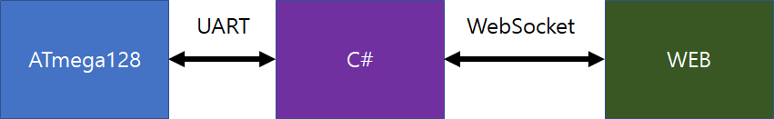
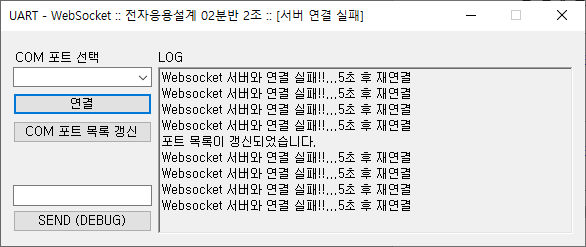
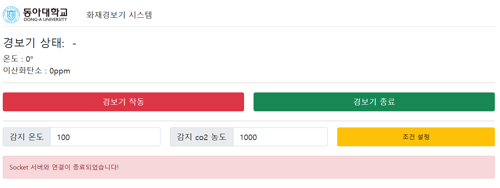

# 화재경보 원격 제어 시스템

팀원: 김기현, 김태욱, 최재원  
스택: C언어, C#, Node.js, UART, Websocket 
기한: 2021.06  

프로젝트 설명:  
Atmega128과 응용 프로그램간 UART 통신으로 센서 정보 및 제어 정보를 주고 받고  
C# 응용 프로그램과 Node.js로 개설된 웹 서버와 WebSocket으로 정보를 주고 받음  

알려진 문제점: Atmega128의 UART 통신이 때때로 안될 때가 있으나 리셋 후 동작

